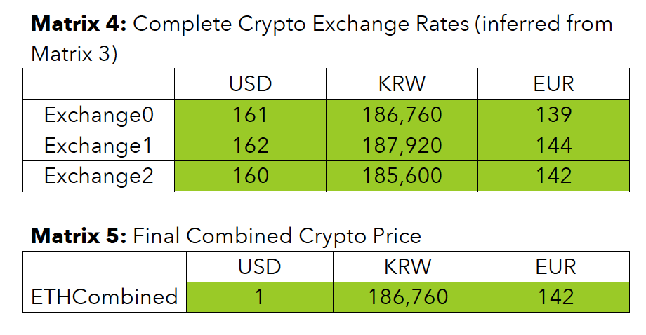

# Terra Oracle Feeder

Oracle feeder is a robust tool that can 

1. fetch and infer ETH (or LUNA) exchange rates in 6 major active currencies (namely KRW, USD, JPY, GBP, EUR, CNY)
2. Submit vote for the price of that specific crypto using `terracli`
3. It can run a daemon in persistent mode such that it fetches and votes once in every regular pre-defined interval. It automatically restarts itself in case of a crash or a system restart.

As this tool is can be a critical part for the network, we designed this with various robust, failsafe mechanisms


## Installation

1. Install [node.js](https://nodejs.org/en/download/) (10.15+ version recommended)
2. Download/clone this repo from `https://github.com/covalent-hq/terra-oracle.git`
3. run `npm install`  in `terra-oracle` directory: This installs necessary node modules
4. run `npm link` : registers the `oracle` CLI commands to `bin/oracle`
5. If you haven't already, please install [Terra](https://docs.terra.money/guide/installation)


## Dependencies and Setups for Terra
1. Obviously one need to have `terrad` and `terracli` [installed](https://docs.terra.money/guide/installation) and running to vote
2. In addition, make sure you have all the necessary node modules
3. Then before testing/interacting with the CLI, one need to make sure `terracli` is running in either Dev or Prod setup

### Dev Setup
1. For Dev setup, one can follow the [local deployment setup](https://docs.terra.money/guide/deploy-testnet) for Terra with 4 local nodes and run `make localnet-start`
2. Then run the CLI with `ENV=dev` e.g. `ENV=dev oracle fetch`

### Prod Setup
1. For Dev setup, one can follow the [terra network validator setup](https://docs.terra.money/guide/validators#create-your-validator) and join the [soju-0008](https://github.com/terra-project/networks/tree/master/soju-0008) live testnet by staking some Luna obtained from the faucet
2. Then run the CLI, optionally with `ENV=prod` e.g. simply `oracle fetch` or  `ENV=prod oracle fetch`

## Functionality, Implmentation, and Mechanism
In this section, 
### `fetch`
This infers the crypto exchange rates in two steps:
1. Fetch Data from APIs: 
    1. We fetch exchange rates for the 6 crypto-fiat pairs from 5 major exchanges. Then we end up with a matrix similar to Matrix1. 
    2. Then we fetch FX rates wrt USD from 3 FX APIs (Matrix 3). Then we get the combined Fx rates by taking a median of each column discarding the missing values (Matrix 3)
2. Infer missing values using FX Data: 
    1. In this step, first we infer the potential values of the crypto for all exchanges by filling out Matrix 1 using the FxCombined rate in Matrix 3 and get Matrix 4
    2. Finally, we take a median along each column to get the final price of the crypto.



Relevant files: `src/fetcher.js, src/forex.js`

### `vote`
This submits a `MsgPriceFeed` call to `terracli` (i.e. `terracli tx oracle vote`). Simply implemented with a child process `exec` module.

Relevant file: `src/vote.js`

### `run`
This is a combination of the `fetch` and `vote` functions. This creates a persistent daemon with `pm2` which fetches relevant values and votes in every pre-specificed time interval (default: 15 mins).

Relevant file: `src/run.js`

### `rm`
This additional command enables us to stop and remove the persistent daemon. Usage
```
oracle rm
```

Relevant file: `src/run.js`

### `help`
With `help`, CLI shows  beautifully formatted help prompts using command-line-usage and chalk. Relevant file: `src/help.js`

### `CLI Parser`
CLI parser implemented on file: `src/cli.js`. It serves to just pass through the arguments to relevant functions.

## Limitations
1. Currently due to some limitations of `ccxt` library, we need to make separate call for every single crypto-fiat pair for each exchange. While we speed it up with a pooled promise (hence they run in parallel), we still need to make 5 * 6 = 30 calls, which is rather expensive and slow. In future, we can try to bring it down to 5 (i.e. number of exchange API) calls.
2. If ALL the major exchanges delist ETH/USD pair, then it might not be possible to infer the exchange values for other currencies. The reason we leaned towards this assumption is that for the free forex API we could find, there was no easy way to obtain covertion rates between non-USD pairs. In addition, it is highly unlikely that all the major crypto exchanges would de-list ETH/USD pair.
2. While we chose 5 major crypto exchanges and they have decent uptime, in case, a coin is listed in very few exchanges, downtime in those exchange APIs could stop this program from working. We could use a caching system. However, as we know crypto and forex both could be volatile and depending on stale values is not a great idea.
3. While we have tried to write various unit tests, due to time limitation our test coverage is not extremely high. All the relevant tests are in `test/` directory.
4. Currently we assume that the `terracli` and the running validator node is persistent. We will also add those commands to process monitor.

## Reference: Interfaces 

The oracle feeder will be distroed in the form of a cli tool, with the following interface:

```
oracle - Command line interface for interacting with the Terra Oracle Feeder 

Usage:
oracle [command]

Available Commands:
fetch       Fetch the current price of luna. If denom is not specified, fetches the prices in all available denoms
run         Runs in daemon mode. Runs periodically (constrained by the interval command) to fetch and vote to the chain
vote        Transactions subcommands

Flags:
--denom string      denomination flag, one of "luna | krt | ust | srt | jpt | gbt | eut | cnt"
-p, --price float       price flag, to be used by vote 
-h, --help              help for oracle
--key string        name of the terra key stored on disk by terracli
--pw  string        password of the terra key 
--interval int      the minute intervals by which oracle should run
```
### Examples: 

`oracle fetch --denom=luna,jpt,eur` - returns a json formatted dict of the current effective prices of Luna in the specified currencies. If there is no active market for Luna in the requested fiat currency, the oracle makes a best effort to translate that value before failing. 

`oracle fetch` - returns a json formatted dict of the current effective prices of Luna in all the known whitelisted currencies. 

`oracle run --interval=15` - fetches and votes every 15 minutes 

`oracle vote --denom=jpt --price=0.1` - submits a `MsgPriceFeed` to `terracli` that claims the price of Luna to be 0.1 JPT/JPY. 
